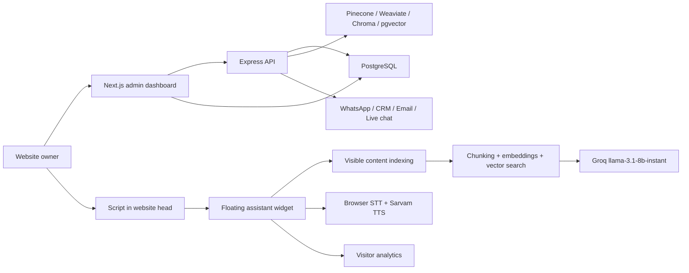

# Architecture

## Request Flow

1. Website owner signs up or logs in.
2. Website owner creates a site from the dashboard.
3. API stores the site in PostgreSQL and returns a unique script tag with `data-site-id`.
4. The script is added to the website `<head>`.
5. On page load, the script extracts visible content and indexes it.
6. The widget sends visitor questions to `/api/chat`.
7. The API stores conversations/messages, detects Hindi/English, retrieves relevant site chunks, and asks Groq.
8. The answer is returned as text or converted to voice when the visitor used voice.

## Language Behavior

- Hindi is the default and priority language.
- Devanagari and Hinglish hints route the response to Hindi.
- English messages receive English answers.
- Voice sessions should use `hi-IN` or `en-IN` settings based on the detected language.

## Data Model

The Prisma schema models:

- users
- sites
- crawled pages
- knowledge chunks
- conversations
- messages
- uploads
- visitor events
- integrations

## RAG Strategy

The starter includes an in-memory vector abstraction for local development. Production should use a persistent vector backend and store these fields:

- `siteId`
- `source`
- `sourceUrl`
- `title`
- `content`
- `embedding`
- `createdAt`

All retrieval must be scoped by `siteId` so one website can never access another website's context.
